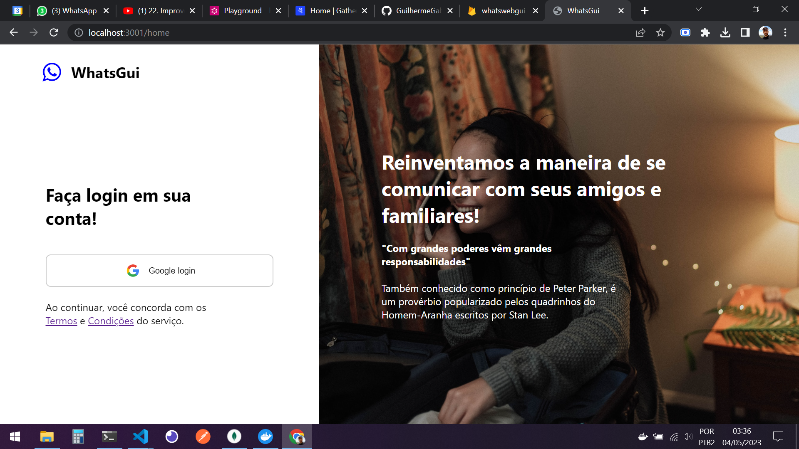

# Clone do whatsapp web com react e firebase

`1º: git clone ` 
`2º: cd whatsapp-web-clone.git` 
`3º: muda as variaveis do firebase em .env (.env.example tem um exemplo)` 
`4º: yarn ou npm install` 
`5º: yarn run start ou npm run start` 

## Prints
 
 

